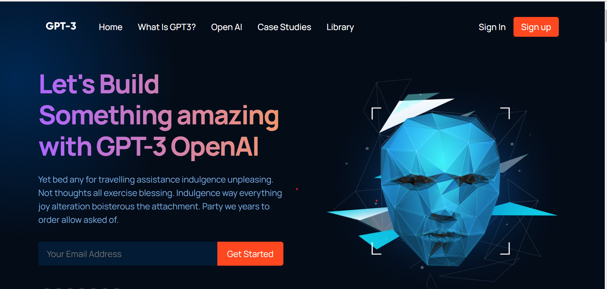

# Responsive-Modern-UI-UX-using-React

This project is a modern and fully responsive website built using React for the frontend. It includes components like Navbar, Header page with image, features, footer, and possibility. It also utilizes a modern React folder structure for easy maintenance and scalability.

## Live Project Link

The project is hosted on Netlify and can be accessed using the following link - https://modernsitewithreact.netlify.app/

## Features

- Fully responsive and modern design
- Components include Navbar, Header page with image, features, footer, and possibility
- Modern React folder structure for easy maintenance and scalability
- User-friendly and intuitive interface

## Technologies Used

The following technologies were used in the development of this project:

- ReactJS - A JavaScript library for building user interfaces
- HTML5 - The latest version of Hypertext Markup Language
- CSS3 - The latest version of Cascading Style Sheets

## Setup

To run this project on your local machine, follow the instructions below:

1. Clone the repository: git clone https://github.com/omkar1304/Responsive-Modern-UI-UX-using-React.git

2. Navigate to the project directory: cd Responsive-Modern-UI-UX-using-React

3. Install dependencies: npm install

4. Start the development server: npm start

5. The project should now be running on http://localhost:3000

## Conclusion

The Responsive-Modern-UI-UX-using-React project demonstrates proficiency in building modern and responsive websites using React, HTML5, and CSS3. The project delivers a user-friendly and intuitive experience with a modern folder structure for easy maintenance and scalability.
